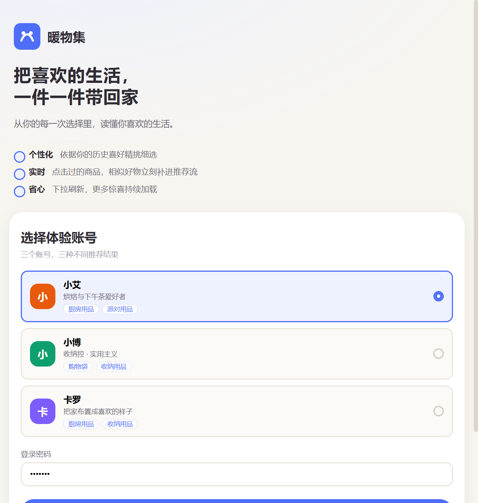
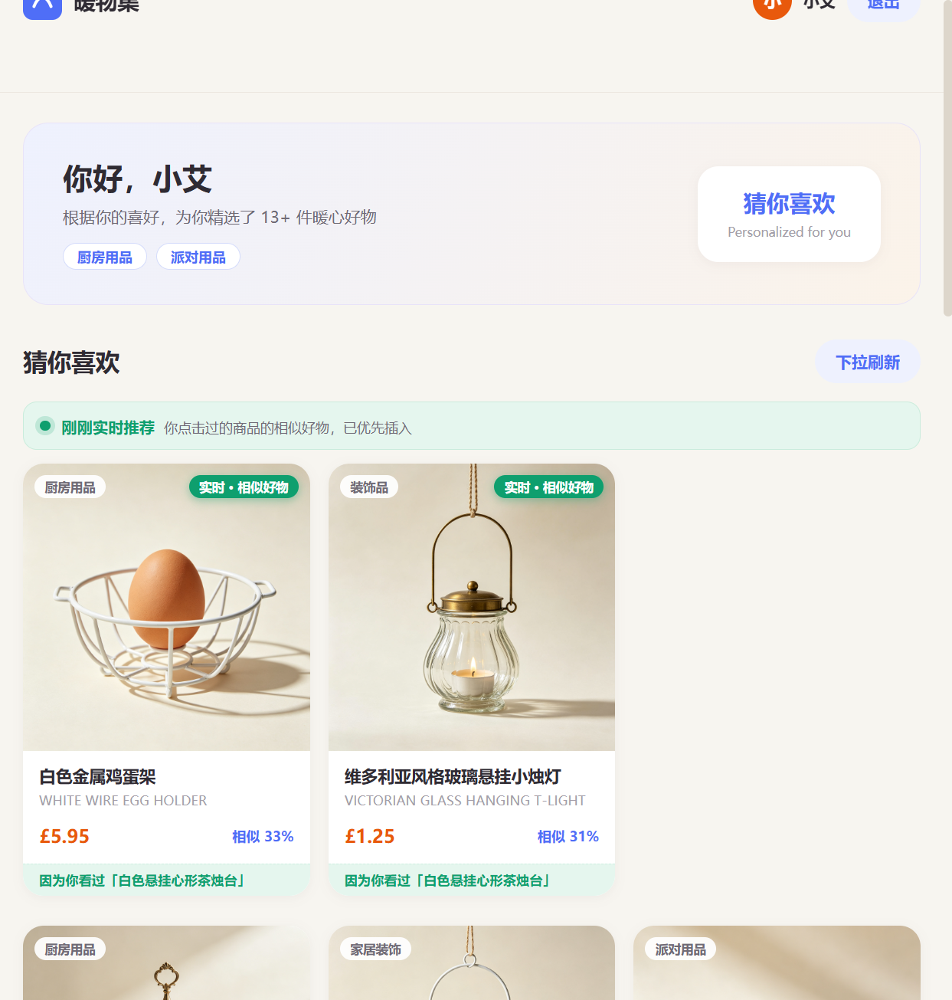
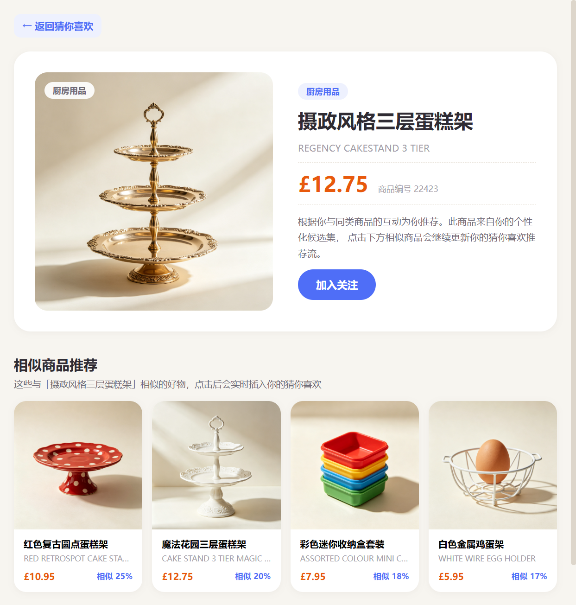

# 暖物集 · 个性化"猜你喜欢"购物平台（RecSys Shop）

> 严格对照《完整推荐系统.pdf》作业要求实现的 **Flask + Vue3 前后端分离**推荐系统。
> 3 个演示账号各自看到不同的个性化推荐；点击商品 → 详情页相似推荐 → 相似商品实时插入推荐流 → 无限下滑分页加载；附带用户中心、我的收藏、购物车完整功能。

---

## 一、项目结构

```
recsys-shop/
├── backend/                        # Python Flask 后端
│   ├── app.py                      # 主应用：19 个接口（登录/注册/推荐/详情/相似/行为/画像/收藏/购物车）
│   ├── recommend.py                # 推荐服务：四层召回 → 精排 → 打散 → 会话去重 → 分页缓存
│   ├── db.py                       # SQLite 存储层：8 张表 + 种子数据 + 密码哈希迁移
│   ├── clean.py                    # 数据清洗（train.csv → RFM 打分 → 每用户 Top50 种子）
│   ├── build_full_catalog.py       # 全量商品目录（4,226 商品，中英文名/类目/价格）
│   ├── build_itemcf.py             # 全量 ItemCF 相似度（69,515 对 / 3,478 商品）
│   ├── build_expanded_recs.py      # 种子扩展未购候选 + 推荐理由种子（seed_code）
│   ├── build_similar.py            # 详情页相似商品预计算（订单共现 Jaccard）
│   ├── expand_candidates.py        # 演示候选集扩展（3 账号 Top50 并集）
│   ├── translations.py             # 672 条人工补翻中文译名映射（唯一翻译源）
│   ├── translate_missing.py        # 译名同步工具（CSV / SQLite / 推荐文件）
│   ├── evaluate.py                 # 离线评估（时间 holdout，HitRate/Recall/NDCG@10）
│   ├── test_api.py                 # 接口自动化验证（18 项）
│   ├── test_no_duplicates.py       # 推荐流零重复回归（9 项）
│   ├── download_pending.py         # 商品图批量下载工具
│   └── data/                       # 清洗产物 + recsys.db（运行时自动初始化）
├── frontend/                       # Vue 3 前端（Vite）
│   ├── vite.config.js              # 开发代理 /api → 127.0.0.1:5000
│   ├── Dockerfile + nginx.conf     # 生产构建（nginx 托管 + 接口反代）
│   ├── public/images/              # 137 张商品实拍图（AI 生成，暖白底统一风格）
│   └── src/
│       ├── api.js                  # 接口封装 + token 会话管理
│       ├── router.js               # 路由守卫（未登录跳登录页）
│       ├── views/LoginView.vue     # 登录 / 注册（兴趣标签冷启动）
│       ├── views/HomeView.vue      # 猜你喜欢：无限流 + 实时插入 + 类目/搜索 + 回顶部
│       ├── views/DetailView.vue    # 详情页：淘宝版式 + 相似推荐 + 收藏/加购
│       ├── views/FavoritesView.vue # 我的收藏
│       ├── views/CartView.vue      # 购物车
│       ├── views/ProfileView.vue   # 账号设置（头像/资料/密码/主题色）
│       └── components/ProductCard.vue
├── docs/screenshots/               # 界面预览图（README 引用）
├── docker-compose.yml              # 一键容器化部署（8080 端口）
├── start.bat                       # Windows 一键启动
└── README.md
```

## 二、功能总览（对照作业要求）

| 作业要求 | 实现方式 |
| --- | --- |
| 至少 3 个账号，各自看到不同推荐 | `alice / bob / carol` 绑定 train.csv 真实 CustomerID，四层召回各自独立，交集极小 |
| "猜你喜欢"个性化推荐 | ItemCF 扩展未购候选 → 精排 → 类目打散 → 会话内零重复，每个候选带"因为你买过「×××」"推荐理由 |
| 点击商品进详情页看相似商品 | `GET /api/items/<code>/similar`，订单共现相似度 Top4 + 同类兜底，code+名称双重去重 |
| 相似商品实时插入推荐流 | 点击上报后端返回 Top3 相似商品 → 前端缓存 → 返回首页去重后置顶插入，标注"实时·相似好物" |
| 下拉刷新分页加载 | IntersectionObserver 触底自动分页；池子滑完显示到底，"换一批"换随机种子开新一轮（同样零重复） |

### 界面预览

| 登录页（三账号选择） | 猜你喜欢 · 实时插入置顶 | 商品详情 · 相似推荐 |
| --- | --- | --- |
|  |  |  |

### 超出作业要求的附加功能

- **用户体系**：注册（兴趣标签冷启动）、改用户名/昵称/签名/主题色、修改密码、头像上传裁剪
- **我的收藏 / 购物车**：真实接口 + 数据库存储，详情页收藏/加购，顶栏数量角标，购物车数量步进与合计
- **安全**：密码 scrypt 哈希入库（明文自动迁移）、token 落库带 7 天过期、登出吊销
- **中文商品名**：全库 4,226 商品 100% 中文名（含 672 条人工补翻）
- **页面体验**：淘宝风格三栏首页、无限下滑、回顶部悬浮按钮、1400px+ 宽屏适配

## 三、快速启动

环境要求：Python 3.10+、Node.js 18+。

### 方式一：一键启动（Windows）

双击 **`start.bat`**，自动启动前后端并打开浏览器。

### 方式二：手动启动

```bash
# 后端（端口 5000）
cd backend
pip install -r requirements.txt
python db.py            # 初始化数据库（幂等）
python app.py

# 前端（端口 5173）
cd frontend
npm install
npm run dev
```

浏览器访问 **http://localhost:5173/**，演示账号密码统一 **`123456`**。

### 方式三：Docker

```bash
docker compose up --build     # 访问 http://localhost:8080
```

## 四、演示账号

| 账号 | 昵称 | 绑定 CustomerID | 兴趣标签 | 密码 |
| --- | --- | --- | --- | --- |
| `alice` | 小艾 | 14911 | 厨房用品、派对用品 | `123456` |
| `bob` | 小博 | 17841 | 购物袋、收纳用品 | `123456` |
| `carol` | 卡罗 | 14606 | 厨房用品、收纳用品 | `123456` |

三个账号的推荐流来自 train.csv 各自真实历史行为（ItemCF 扩展候选），**交集极小，个性化成立**。也可在登录页注册新账号（选兴趣标签，走冷启动推荐）。

## 五、系统模块划分

| 模块 | 职责 | 代码位置 |
| --- | --- | --- |
| 用户服务 | 登录、注册、鉴权（token 表）、资料/密码/头像 | `backend/app.py` + `db.py` |
| 推荐服务 | 四层召回、精排、打散、会话去重、分页缓存 | `backend/recommend.py` |
| 商品服务 | 商品详情、相似商品查询 | `backend/app.py` + `recommend.py` |
| 行为采集服务 | 点击日志落库、返回实时插入候选 | `backend/app.py`（/api/behaviors） |
| 前端页面 | 登录/注册、猜你喜欢、详情、收藏、购物车、账号设置 | `frontend/src/views/*` |

## 六、关键流程设计

### 6.1 用户登录 —— 鉴权后如何绑定用户身份
1. 前端提交 `username + password` 到 `POST /api/auth/login`；
2. 后端用 Werkzeug scrypt 校验密码哈希，生成随机 token 写入 `tokens` 表（TTL 7 天，过期自动清理）并**绑定该用户的真实 CustomerID**；
3. 前端将 token 存入 `sessionStorage`，后续请求带 `Authorization: Bearer <token>`；
4. 推荐接口根据 token 反查 CustomerID，返回**该用户专属**推荐；登出吊销 token。

### 6.2 加载"猜你喜欢" —— 如何拿到该用户的推荐列表

**召回链路（清洗后的数据集 → 候选集 → 推荐流）**：
```
train.csv（33万行原始交易）
 └─ clean.py：RFM 式打分 → user_recs_clean.csv（每用户 Top50 已购种子）
     └─ build_itemcf.py：客户级共现 + 余弦归一 → item_similar_full.csv（69,515 对）
         └─ build_expanded_recs.py：种子经 ItemCF 扩展 + 已购全量过滤
             → user_recs_expanded.csv（每用户 ~40 个未购候选，含推荐理由种子）
```
在线召回**四层降级**：① ItemCF 扩展未购候选 → ② 历史 Top50 → ③ 兴趣冷启动（新注册用户按标签）→ ④ 全站热门兜底；整个候选池统一过滤已购（`user_purchased.csv`）。之后精排（CF 分降序）→ 类目打散（同类不相邻）→ 会话已见表（`sessions`）过滤保证**本会话零重复** → 分页返回（带推荐理由）。

### 6.3 点击商品进详情页 —— 如何请求相似商品
前端跳转详情路由 → 并行请求 `GET /api/items/<code>` 与 `GET /api/items/<code>/similar?limit=4`；相似商品来自预计算 `item_similar.csv`（订单共现 Jaccard），同类别兜底，code+名称双重去重。

### 6.4 实时插入相似商品 —— 点击行为如何触发推荐流更新
点击商品卡片 → `POST /api/behaviors` 上报点击日志（落 `behaviors` 表）→ 后端查该商品 Top3 相似商品（过滤已展示/已点击/自身，名称级去重）→ 随响应返回 `inserted` → 前端存 `sessionStorage` 后进详情页 → **返回首页时**读取缓存、双重去重后置顶插入推荐流（标注"实时·相似好物"）。

### 6.5 下拉刷新 / 无限下滑 —— 如何分页拉取后续推荐
首页 IntersectionObserver 监听底部哨兵，触底自动请求下一页。一次浏览会话内每个商品只出现一次：候选池（约 56~60 个）跨页不重复，滑完显示"到底啦"；"换一批"（page≤1）时 `cycle+1` 换随机种子重排开启新一轮，新一轮同样零重复。

## 七、数据与存储设计

SQLite（`backend/data/recsys.db`），共 **8 张表**：

| 表 | 关键字段 | 说明 |
| --- | --- | --- |
| users | id, username, password(哈希), nickname, customer_id, interest, avatar, color, slogan | 用户；customer_id 绑定数据集真实 ID（9 开头号段为注册用户） |
| products | code(PK), en_name, cn_name, category, price, img | 全量目录 4,226 商品；137 个演示商品带真实图片 |
| behaviors | id, user_id, item_code, action, created_at | 点击/浏览行为日志 |
| rec_cache | user_id+page(PK), payload(JSON), updated_at | 推荐结果缓存（模拟 Redis） |
| tokens | token(PK), customer_id, expires_at | 登录令牌，TTL 7 天，可吊销 |
| sessions | customer_id(PK), cycle, shown(JSON) | 浏览会话状态（轮次 + 已展示集合），多 worker 一致 |
| favorites | user_id+item_code | 我的收藏 |
| cart | user_id+item_code, qty, updated_at | 购物车（数量累加） |

**缓存策略**：`rec_cache` 按 `user_id:page` 命中直接返回，未命中计算后写回；生产可无缝替换 Redis（`SET user:{id}:page:{n} {json} EX 600`）。相似商品离线预计算为 CSV，查询时 join 商品表返回。

## 八、接口设计（19 个）

| 分类 | 接口 | 方法 | 说明 |
| --- | --- | --- | --- |
| 认证 | /api/auth/login | POST | 登录，返回 token + user |
| | /api/auth/register | POST | 注册（用户名/密码/昵称/兴趣标签），重名拒绝 |
| | /api/auth/logout | POST | 登出吊销 token |
| 用户 | /api/profile | GET | 用户画像 + 点击数 |
| | /api/profile/update | POST | 改用户名/昵称/签名/主题色/兴趣标签 |
| | /api/profile/password | POST | 改密码（旧密码校验，哈希入库） |
| | /api/profile/avatar | POST | 头像上传（dataURL，≤200KB） |
| 推荐 | /api/recommend | GET | 分页推荐流（Bearer 鉴权，带理由/轮次/has_more） |
| | /api/items/\<code\> | GET | 商品详情 |
| | /api/items/\<code\>/similar | GET | 相似商品 TopN（含相似度） |
| 行为 | /api/behaviors | POST | 点击上报，返回实时插入候选 inserted[] |
| 收藏 | /api/favorites | GET | 收藏列表 |
| | /api/favorites/toggle | POST | 收藏/取消 |
| | /api/favorites/status | GET | 批量查询收藏状态 |
| 购物车 | /api/cart | GET | 购物车列表（含合计） |
| | /api/cart/add | POST | 加购（重复累加数量） |
| | /api/cart/qty | POST | 改数量 |
| | /api/cart/remove | POST | 移除单项 |
| 其他 | /api/health | GET | 健康检查 |

## 九、离线流水线与评估

```bash
cd backend
python clean.py                # 清洗 → user_recs_clean.csv（3,913 用户 × Top50）
python build_full_catalog.py   # 全量目录 → products_full.csv（4,226 商品）
python build_itemcf.py         # ItemCF → item_similar_full.csv（69,515 对）
python build_expanded_recs.py  # 扩展未购候选 → user_recs_expanded.csv + user_purchased.csv
python build_similar.py        # 详情页相似对 → item_similar.csv
python evaluate.py 800         # 离线评估 → data/eval_report.txt
```

**评估结果**（800 用户，时间 holdout）：

| 策略 | HitRate@10 | Recall@10 | NDCG@10 |
| --- | --- | --- | --- |
| 历史打分 Top10（旧口径，只推买过的） | 0.0000 | 0.0000 | 0.0000 |
| 全站热门 Top10（基线） | 0.4925 | 0.0464 | 0.1043 |
| **ItemCF 扩展 Top10（现口径）** | **0.6250** | **0.0926** | **0.2014** |

现口径对热门基线 HitRate@10 相对提升 **+54.6%**。

## 十、作业交付物

对应《完整推荐系统.pdf》要求，交付内容齐全：

| 交付项 | 位置 |
| --- | --- |
| 数据与存储设计 / 接口设计 | 本 README 第七、八节 |
| 时序图 1：加载"猜你喜欢" | `../homework/时序图1_加载猜你喜欢.drawio` |
| 时序图 2：实时插入相似商品 | `../homework/时序图2_实时插入相似商品.drawio` |
| 实时插入实现说明 + 思考题 | `../homework/作业说明.md`（Word 版：`../homework/作业说明.docx`） |

> .drawio 文件用 https://app.diagrams.net 或 draw.io 桌面版打开，可编辑/导出 PNG/SVG/PDF。

## 十一、验证方式

```bash
cd backend
python test_api.py               # 18 项接口验证（登录/注册/推荐/收藏/购物车…）
python test_no_duplicates.py     # 推荐流零重复回归（3 账号 × 3 检测点）
```

人工路径：登录 → 首页个性化推荐（带理由）→ 点击商品看详情相似推荐 → 返回首页看"实时·相似好物"置顶 → 无限下滑验证零重复 → 收藏/加购看角标 → 账号设置改头像/密码。

## 十二、常见问题

- **端口被占用**：后端改 `app.py` 末尾 port 并同步 `frontend/vite.config.js` 的 proxy target；前端 `npm run dev -- --port 5174`。
- **图片不显示**：确认 `frontend/public/images/` 下有 p01~p137.jpg（已内置）。
- **重建数据**：把原始 `train.csv`、`products_clean.csv` 复制到 `backend/data/`，按第九节顺序执行流水线，最后 `python translate_missing.py` 补中文译名、`python db.py` 重新初始化。
- **多 worker 部署**：token/sessions 均已落 SQLite，gunicorn 多 worker 下状态一致。

## 十三、免费云端部署（无需买服务器）

两条零成本路线，详见 [`docs/免费部署指南.md`](docs/免费部署指南.md)：

- **cpolar 内网穿透**：本地跑起来后 5 分钟得到公网 HTTPS 链接，适合课堂/答辩演示（电脑开机才在线，免费域名每次重启变化）
- **Render 免费托管**：`render/` 目录提供单容器镜像（nginx 托管前端 + 反代同容器 gunicorn），推 GitHub 后在 Render 上以 `Docker Context=./, Dockerfile Path=./render/Dockerfile` 创建 Free Web Service，得到固定 `*.onrender.com` 域名，24 小时在线（15 分钟无访问休眠、重部署数据重置为种子数据）

## 十四、版本记录

| 日期 | 内容 |
| --- | --- |
| 2026-09-10 | 基础版：Flask+Vue3、Top50 推荐、详情相似、实时插入、无限流 |
| 2026-09-10 | 已购过滤 + ItemCF 候选扩展 + 离线评估（HitRate@10 0.625 vs 热门 0.493） |
| 2026-09-10 | 安全加固（scrypt 哈希 / token 落库过期）+ Docker 部署 |
| 2026-09-10 | 推荐理由 + 兴趣冷启动 + 会话状态落库（多 worker 一致） |
| 2026-09-10 | 推荐流零重复修复（前端双重去重 + 后端名称级去重，回归 9/9 PASS） |
| 2026-09-10 | 用户中心（注册/改资料/头像/改密）+ 收藏 + 购物车（接口+落库） |
| 2026-09-10 | 商品名 100% 中文化（672 条人工补翻，translations.py 为唯一翻译源） |
| 2026-09-10 | UI 打磨：淘宝三栏首页/详情版式、页面加宽至 1500px、回顶部按钮 |
